## Amazon SageMaker training jobs using Snowflake Snowpark Python API

[Amazon SageMaker](https://aws.amazon.com/sagemaker/) is a fully managed service for data science and machine learning (ML) workflows. You can use Amazon SageMaker to simplify the process of building, training, and deploying ML models.

To train a model, you can include your training script and dependencies in a [Docker container](https://www.docker.com/resources/what-container) that runs your training code. A container provides an effectively isolated environment, ensuring a consistent runtime and reliable training process.

The [Snowpark library](https://docs.snowflake.com/en/developer-guide/snowpark/index.html) provides an intuitive API for querying and processing data in a data pipeline. Using the Snowpark library, you can build applications that process data in Snowflake without moving data to the system where your application code runs. You can also automate data transformation and processing by writing stored procedures and scheduling those procedures as tasks in Snowflake.

In this GitHub repository we will demonstrate how to use SageMaker training jobs using Snowpark Python API to fetch data from Snowflake.

The following figure represents the high-level architecture of the proposed solution to use Snowflake as a data source, using Snowpark Python API to train ML models with Amazon SageMaker.
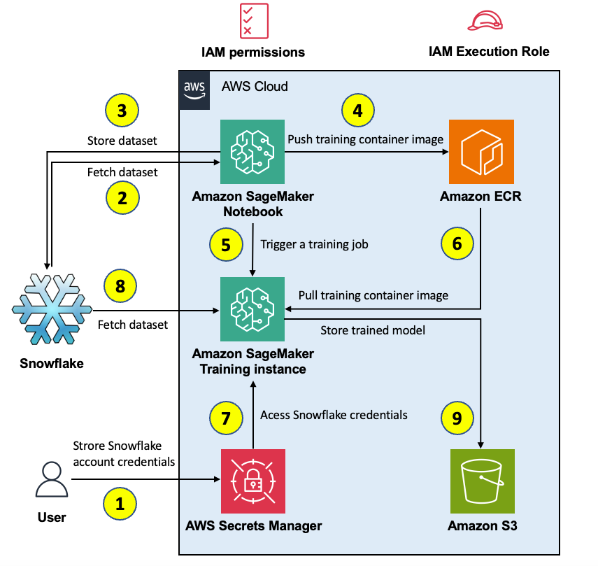

## Prerequisite

- An AWS Account.
- An IAM user with SageMaker and CodeBuild permissions.
- Snowflake account - you can sign up [here](https://signup.snowflake.com/).

## Setup

We suggest for the initial setup, to use Cloud9 on a `m5.large` instance type with 64 GB of storage.

## Build a custom SageMaker Studio image with Snowpark already installed

We aim to explain how to create a custom image for Amazon SageMaker Studio that has Snowpark already installed. The advantage of creating an image and make it available to all SageMaker Studio users is that it creates a consistent environment for the SageMake Studio users, which they could also run locally.
To create the custom Conda environment for Snowpark, please follow the instructions [here](snowflake-env-kernel-image).

After you complete this step, the outcome should be a `snowflake-env-kernel` attached to your SageMaker Studio domain  
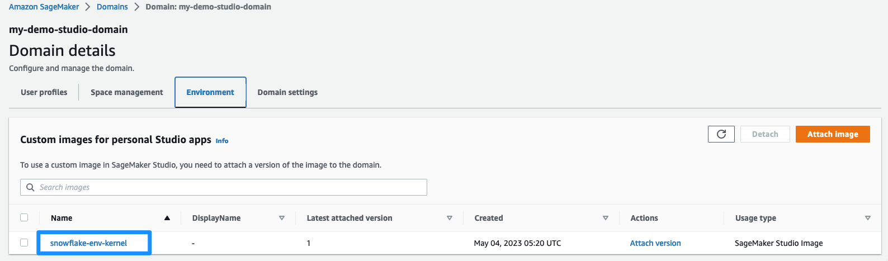

## Store Snowflake credentials on AWS Secrets Manager

Secrets Manager enables you to replace hardcoded credentials in your code, including passwords, with an API call to Secrets Manager to retrieve the secret programmatically. This helps ensure the secret can't be compromised by someone examining your code, because the secret no longer exists in the code. 

We recommend to store Snowflake `account`, `user` and `password` in AWS Secrets Manager. 

1. Navigate to AWS Secrets Manager on the console and choose `Store new secret`
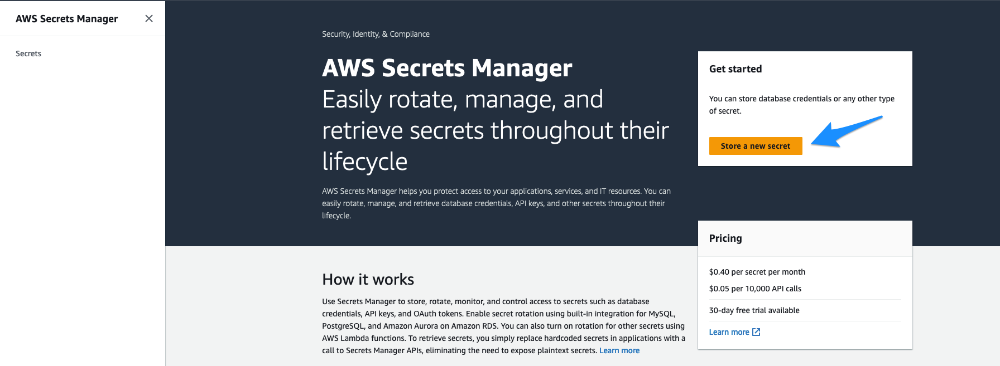
2. Choose `Other type of secret`, add rows for `account`, `user` and `password` and fill your Snowflake account id, username and password.
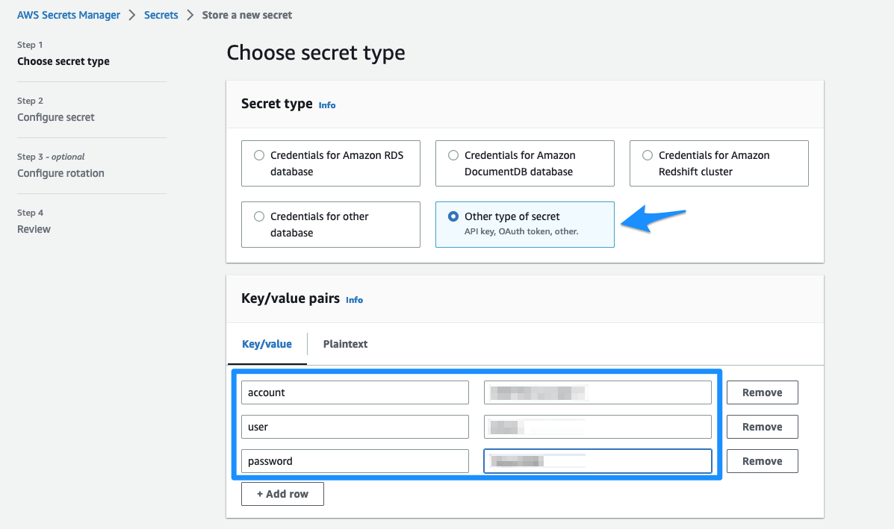
3. Choose `Next`
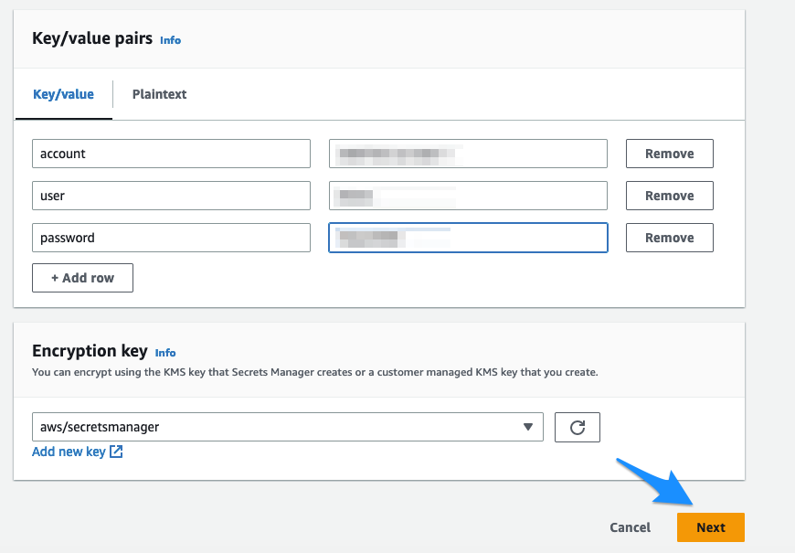
4. Give secret a name: `dev/ml/snowflake`
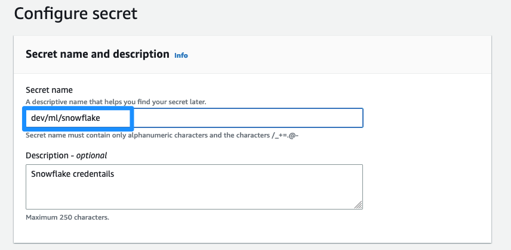
5. Choose `Store`
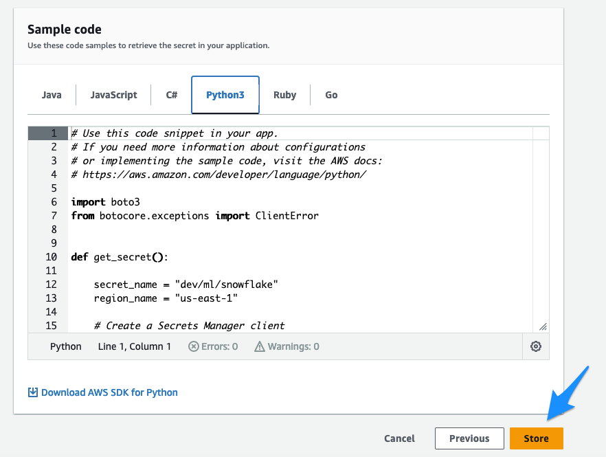

## Populate the Snowflake tables 

Run the [Getting Started with Snowpark for Machine Learning on SageMaker workshop](https://quickstarts.snowflake.com/guide/getting_started_with_snowpark_for_machine_learning_on_sagemaker/index.html) to populate the Snowflake tables.

When opening the notebooks on SageMaker Studio, choose `snowflake-env-kernel` kernel you have created in previous step.  

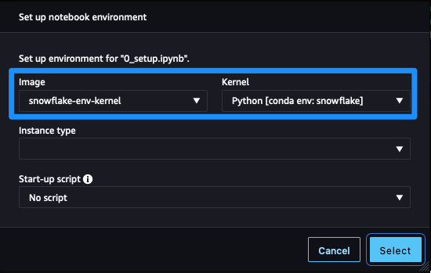

Upon completing the Getting Started with Snowpark for Machine Learning on SageMaker workshop, you should have the `HOL_DB.PUBLIC.MAINTENANCE_HUM` table populated.
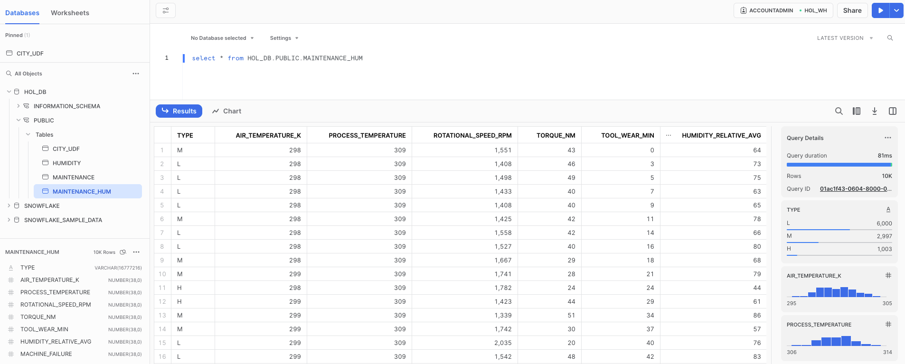

## Run the SageMaker Training notebook

1. Clone this GitHub repository on SageMaker Studio
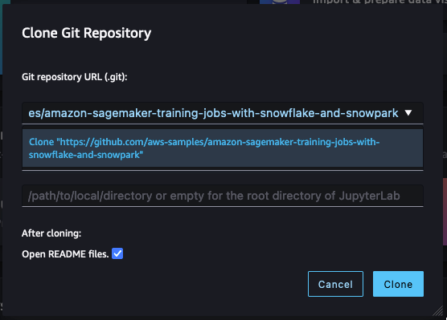

Alternatively, you can open terminal in SageMaker Studio (File -> New -> Terminal) and execute:
`git clone https://github.com/aws-samples/amazon-sagemaker-training-jobs-with-snowflake-and-snowpark`

2. Open the [snowflake_bring_your_own_container_training notebook](./snowflake_bring_your_own_container_training/snowflake_bring_your_own_container_training.ipynb), you can choose any kernel. Run the notebook cell by cell and read the instructions.   
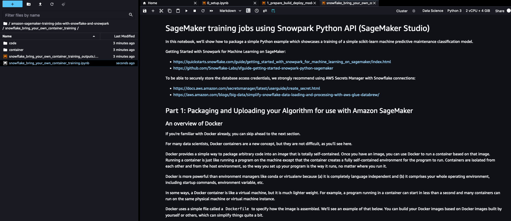

## Security

See [CONTRIBUTING](CONTRIBUTING.md#security-issue-notifications) for more information.

## License

This library is licensed under the MIT-0 License. See the LICENSE file.

